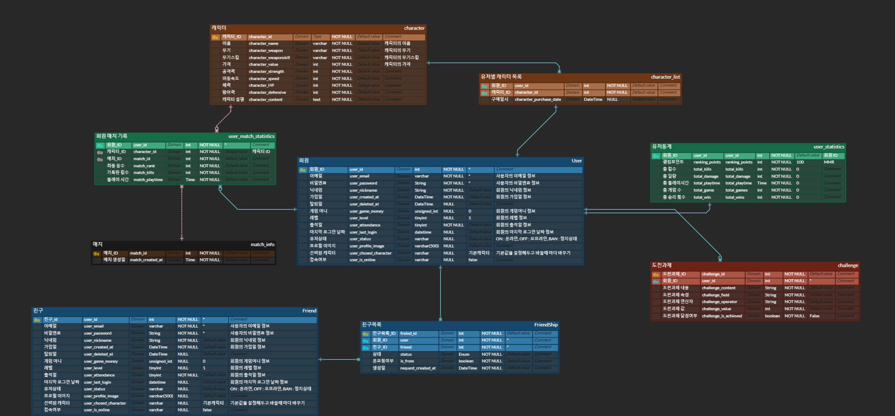

<h1>DropZone</h1>

<h3 style="text-align: center;">SSAFY 11기 2학기 특화 프로젝트</h3>

 

## 👩‍👩‍👦‍👦팀원 소개

|  |  |  |  |  |  |
| :----------------------------------------------------------: | :-------------------------------------------------------: | :-----------------------------------------------------: | :---------------------------------------------------: | :--------------------------------------------------------: | :-----------------------------------------------------: |
|         [황준 - CL](https://github.com/hwangprogram)         |            [손동희 - CL](https://github.com/)             |        [김동준 - CL](https://github.com/kdj4355)        |      [박재영 - CL, BE](https://github.com/INPII)      |        [차상곤 - BE](https://github.com/CHASANGGON)        |        [김헌규 - BE](https://github.com/HG-KR98)        |

 

<h2>🌍Tech Stack</h2>

### Client

### BackEnd

 

### DB

 

### CI/CD

 

### Team Collaboration Tools

 

 

## 🚀Architecture

 

## ERD

 

## 📘소개

#### 🌃 기획의도

SSAFY에서 진행되는 프로젝트마다 새로운 팀원들과 친해지는 시간이 필요한데, 이를 돕기 위해 짧고 간단하게 즐길 수 있는 게임을 기획했습니다. 이 게임은 팀원들뿐만 아니라 다양한 사람들과도 자연스럽게 소통하고, 10분 내로 가볍게 즐기며 서로를 알아갈 수 있는 시간을 제공하는 것이 목표입니다. 게임을 통해 부담 없이 친해지며 협업의 시너지를 높일 수 있도록 설계되었습니다.

 

#### 💎 서비스 대상

- 프로젝트 팀원들: 새로운 프로젝트에서 팀원들과 자연스럽게 친해지고 싶은 사람들.

- 친구들: 친구들과 가볍게 게임을 즐기며 소통하고 싶은 사람들.

- 모든 SSAFY 교육생: 프로젝트의 부담 없이 가볍게 즐길 수 있는 게임을 찾는 사람들.

 

## 주요 컨텐츠

### 최후의 1인

6명의 플레이어가 참여하는 배틀 로얄 게임으로, 최후의 1인이 을 때까지 싸우고 생존하는 것이 목표입니다.

 

### 떨어지는 섬

일정 시간마다 맵이 줄어들며, 맵의 일부가 떨어져 나갑니다. 플레이어는 점점 좁아지는 맵에서 생존하기 위해 떨어지는 구역을 피하며 싸워야 합니다.

 

### 4명의 캐릭터🚀

게임에는 4명의 캐릭터가 등장합니다. 근접 캐릭터로는 복서와 펑크, 원거리 캐릭터로는 솔저와 아처가 있으며, 플레이어는 게임 시작 전에 원하는 캐릭터를 선택하여 참여할 수 있습니다.

 

### 미니 게임

본게임에 들어가기 전, 5단계로 구성된 미니 게임을 플레이하게 됩니다. 각 스테이지에는 총 4개의 포탈이 배치되어 있으며, 다른 유저들보다 빠르게 포탈을 이용해 다음 스테이지로 이동해야 합니다. 가장 먼저 5스테이지에 도달한 플레이어는 본게임에서 사용할 수 있는 아이템을 보상으로 받습니다.

 

## 주요 기술

### 멀티 플레이

Photon PUN2를 사용하여 네트워크 동기화를 구현함으로써, 최대 6명의 플레이어가 실시간으로 같은 게임에 접속해 함께 플레이할 수 있는 멀티플레이 기능을 완성했습니다. 이를 통해 각 플레이어의 움직임과 행동이 서버와 동기화되어, 모든 유저에게 동일한 게임 환경을 제공하며 원활한 게임 진행을 보장합니다.

 

### 보안

Spring Security와 JWT(Json Web Token)를 활용하여 로그인 과정의 보안을 강화하고, 인증 및 권한 부여와 관련된 다양한 로직에 대한 보호를 구현했습니다. 이를 통해 사용자의 정보를 안전하게 관리하고, 토큰 기반 인증 방식을 통해 서버와 클라이언트 간의 신뢰성 있는 통신을 보장합니다.

 

### 채팅

Spring STOMP를 이용해 실시간 채팅 기능을 구현하여, 로비에서 유저들 간의 원활한 소통이 가능하도록 했습니다. WebSocket을 기반으로 동작하는 STOMP 프로토콜을 사용하여, 서버와 클라이언트 간의 안정적인 메시지 전송을 지원하고, 다수의 유저가 동시에 참여할 수 있는 채팅 환경을 제공합니다.

 

### 맵 드랍 알고리즘

맵 드랍 알고리즘은 게임 시작 시 마지막까지 남을 타일을 미리 지정하고, 그 타일을 기준으로 가장 멀리 떨어진 타일부터 순차적으로 제거하는 방식으로 작동합니다. 타일 제거는 Manhattan 거리를 기준으로 하며, 20% 확률로 무작위 타일을 제거하는 랜덤 요소도 포함되어 있습니다. 이 과정에서 DFS(깊이 우선 탐색)을 사용하여 모든 타일이 연결된 상태를 유지하며, 섬이 형성되지 않도록 보장합니다. 이를 통해 맵의 모양이 무작위로 변형되어 매 게임마다 변칙성이 더해지고, 맵이 좁아질수록 긴장감이 고조되어 플레이어들이 결국 전투를 벌일 수밖에 없는 상황을 만듭니다.

 

### 상자 랜덤 생성 알고리즘

상자 랜덤 생성은 Fisher-Yates 알고리즘을 활용하여 구현되었습니다. 이 알고리즘을 통해 맵 내의 스폰 지점들 중에서 상자들이 무작위로 생성되도록 하였습니다. Fisher-Yates 알고리즘은 랜덤성을 보장하면서도 중복 없이 상자를 배치할 수 있어, 게임 내에서 공정한 상자 배치가 이루어집니다.

 

## 게임 이용 화면

### 회원 가입

### 로그인

### 캐릭터 선택

### 게임 매칭

### 인게임

#### 로딩

#### 아이템 파밍

#### 무기 업그레이드

#### 싸움

